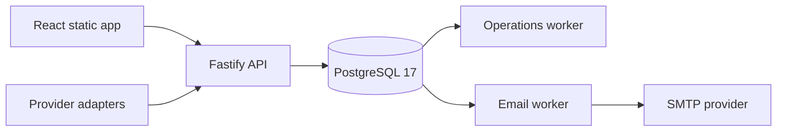

# EarnPearls

> **Your Time. Your Rewards.**

EarnPearls is a survey-first rewards platform built around transparent reward states,
exact accounting, safe administration, and a modular path to future reward products.
The Version 1 application is implemented as a React/Vite frontend, a Fastify API, and
PostgreSQL 17.

## Release status

The full Version 1 product surface is implemented and covered by the repository release
gate. The current environment is a synthetic staging release—not a live-money production
launch. These activation gates remain deliberately closed:

- every real survey-provider adapter and credential;
- every real payout method and payout-processing integration;
- the global withdrawal switch and wallet-adjustment switch;
- owner-approved legal copy, production monitoring, and a proved backup restore;
- object storage plus malware scanning for support attachments;
- future modules such as referrals, offerwalls, cashback, and games.

No code path may infer approval for those items. Staging uses a hidden demo provider,
three synthetic surveys, disabled demo payout methods, and one ledger-balanced rejected
withdrawal with no payout reference.

## Product coverage

Member experience:

- registration, verification, login, password recovery, revocable sessions, and CSRF;
- dashboard, profile completion, preferences, activity, and security controls;
- survey discovery, detail, start, provider confirmation, and history;
- exact Pending → Validated → Mature → Withdrawable wallet lifecycle;
- withdrawal eligibility, encrypted destinations, history, estimates, and support links;
- notifications, leaderboards, support conversations, FAQs, CMS pages, and blog.

Administrator experience:

- live operational dashboard, user search/export/detail, moderation, and force logout;
- reusable Limit Templates, RBAC roles, country policy, and platform settings;
- provider registry/health, reconciliation, wallet settlement, and withdrawal review;
- payout-method definitions that remain independently disabled by default;
- versioned pages/blog/FAQ content, announcements, broadcasts, and email templates;
- support queue, leaderboards, jobs/retries, analytics, security events, and audit logs.

Platform controls:

- append-only financial and audit records, exact integer point/USD-micro accounting;
- modular provider adapters, signed/idempotent webhooks, and settlement evidence model;
- maintenance mode, independent feature gates, and safe configuration validation;
- transactional email outbox plus operations worker for scheduling, rollups, rankings,
  broadcasts, and retention cleanup;
- generated OpenAPI, dynamic XML sitemap, robots/metadata, CI, CodeQL, and Docker.

## Architecture



PostgreSQL is the transactional source of truth. The API, provider adapters, workers,
SMTP provider, and hosting vendor are replaceable boundaries. Financial transitions run
inside database transactions and produce immutable evidence.

## Local development

Requirements: Node.js 24+, npm 11+, and PostgreSQL 17+ (or Docker).

```bash
cp .env.example .env
npm ci --no-audit --no-fund
npm run db:migrate
npm run db:seed
npm run dev:api
```

In a second terminal:

```bash
npm run dev
```

The API defaults to `http://localhost:3001`; development OpenAPI UI is available at
`/documentation`. Set `ALLOW_DEMO_DATA=true` only for an isolated synthetic database.

Run the complete repository gate:

```bash
npm run check
npm audit --omit=dev --audit-level=high
npm audit --audit-level=low
```

Start the local container topology:

```bash
docker compose -f infra/docker-compose.yml up --build postgres migrate api
```

## Repository map

- `src` — public, member, and administrator React application
- `apps/api` — API modules, migrations, workers, seed, and integration tests
- `packages/contracts` — shared TypeBox schemas and exact API contracts
- `docs/api/openapi.json` — generated OpenAPI document
- `docs/product` — business/product blueprints and roadmap
- `docs/architecture` — system and database design
- `docs/operations` — administrator, user, monitoring, backup, and release manuals
- `docs/deployment` — staging topology and deployment runbooks
- `infra` — container and staging supervisor definitions

## Documentation

- [Business blueprint](docs/product/BUSINESS-BLUEPRINT.md)
- [Product blueprint](docs/product/PRODUCT-BLUEPRINT.md)
- [Roadmap](docs/product/ROADMAP.md)
- [System architecture](docs/architecture/SYSTEM-ARCHITECTURE.md)
- [Database architecture](docs/architecture/DATABASE.md)
- [API guide](docs/api/README.md)
- [Configuration](docs/CONFIGURATION.md)
- [Admin manual](docs/operations/ADMIN-MANUAL.md)
- [User manual](docs/operations/USER-MANUAL.md)
- [Security policy](SECURITY.md)
- [Backup and recovery](docs/operations/BACKUP-RECOVERY.md)
- [Monitoring runbook](docs/operations/MONITORING-RUNBOOK.md)
- [Release checklist](docs/operations/RELEASE-CHECKLIST.md)
- [Staging runbook](docs/deployment/STAGING-RUNBOOK.md)
- [Troubleshooting](docs/TROUBLESHOOTING.md)
- [Contribution guide](CONTRIBUTING.md)

## Immutable product rules

- The default conversion is configurable at 1,000 points = USD 1.00; USD remains the
  accounting source of truth and money never uses JavaScript floating point.
- Provider confirmation or evidenced administrator reconciliation is required for
  validation; elapsed time alone never validates a reward.
- Limit Templates only remove capabilities. They can never grant a permission.
- Initial enabled countries are US, GB, CA, IE, AU, DE, BE, SA, AE, QA, OM, and BH.
  PK, IN, BD, and CN are explicitly blocked for launch.
- English is the only active Version 1 language; the architecture does not prevent a
  future localization layer.
- Public testimonials remain labeled placeholders until genuine, approved evidence exists.

See [CHANGELOG.md](CHANGELOG.md) for the implementation history and
[docs/operations/RELEASE-CHECKLIST.md](docs/operations/RELEASE-CHECKLIST.md) before any
environment promotion.
