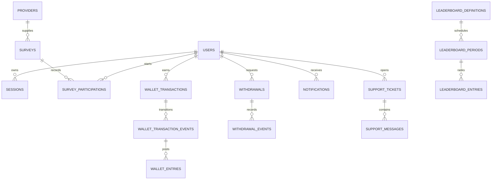

# EarnPearls Database Architecture

PostgreSQL 17 is the source of truth. Migrations are ordered, forward-only SQL under
`apps/api/migrations`; the migration runner records checksums and refuses changed applied
migrations. Seed data is idempotent and safe defaults remain disabled.

## Domain model



## Table catalog

### Identity and policy

| Tables | Purpose |
| --- | --- |
| `users`, `user_preferences`, `user_activity_events` | profile, communication choices, member-visible activity |
| `sessions`, `auth_tokens` | opaque sessions and single-use verification/reset tokens |
| `roles`, `permissions`, `role_permissions`, `user_roles` | grant model |
| `limit_templates`, `limit_template_permissions` | reusable capability denials |
| `account_states`, `account_state_events` | moderation state and immutable history |
| `country_availability` | launch registration policy |

### Surveys, ledger, and withdrawals

| Tables | Purpose |
| --- | --- |
| `providers`, `surveys`, `survey_participations`, `provider_events` | provider catalog and normalized evidence |
| `wallet_transactions` | immutable amount/source facts and current bucket projection |
| `wallet_transaction_events` | ordered state-transition evidence |
| `wallet_entries` | append-only bucket deltas used to derive balances |
| `withdrawal_methods`, `withdrawals`, `withdrawal_events` | disabled-first method rules, reservations, decision history |
| `provider_settlements`, `provider_settlement_items` | settlement evidence linking provider funds to rewards |
| `idempotency_records` | duplicate mutation protection |

### Experience and operations

| Tables | Purpose |
| --- | --- |
| `notifications`, `notification_deliveries`, `email_outbox` | in-app/email state and delivery queue |
| `email_templates`, `email_template_revisions` | safe configurable messaging and immutable versions |
| `support_ticket_categories`, `support_tickets`, `support_messages`, `support_ticket_events`, `support_attachments` | support case system; attachment delivery is gated |
| `cms_pages`, `cms_page_revisions` | public pages and version history |
| `blog_categories`, `blog_posts`, `blog_post_revisions`, `blog_tags`, `blog_post_tags` | blog CMS and SEO content |
| `faqs`, `faq_revisions`, `legal_documents`, `user_consents` | knowledge and legal/consent evidence |
| `leaderboard_definitions`, `leaderboard_periods`, `leaderboard_entries`, `leaderboard_exclusions` | ranking definitions/materialization/privacy |
| `background_job_runs`, `provider_sync_runs` | recurring/admin jobs and provider diagnostics |
| `analytics_daily` | aggregate daily metrics |
| `system_settings`, `system_setting_revisions` | configurable product policy and versions |
| `announcements`, `audit_logs`, `security_events` | operator communication and evidence |

## Exact accounting

Points are signed `BIGINT`; USD is signed integer micro-units (`BIGINT`). Public contracts
use decimal strings. The configured points conversion is also a positive integer string.
Optional display rates are decimal strings with an effective date and never replace USD.

Balance is derived as:

```sql
SELECT bucket, SUM(points_delta), SUM(usd_micros_delta)
FROM wallet_entries
WHERE user_id = $1
GROUP BY bucket;
```

`wallet_entries` and transaction events are append-only. A transaction’s financial facts
(user, kind, source, point/USD amount) cannot be changed. State projection changes only
through service-controlled transactions that append matching evidence.

## Integrity and delete policy

- foreign keys default to `RESTRICT` for financial/audit evidence;
- user-owned ephemeral preferences/sessions may cascade where deletion is safe;
- users are soft archived through `deleted_at`; financial facts remain referential;
- unique provider external IDs, idempotency keys, revisions, and period keys prevent replay;
- check constraints restrict states, ISO-like codes, slugs, positive bounds, and windows;
- append-only triggers reject `UPDATE`/`DELETE` on financial, audit, security, revision,
  consent, support-message/event, settlement-item, and withdrawal-event evidence.

## Index strategy

Indexes follow bounded access patterns:

- session token hash and user activity/expiry;
- survey provider/external ID, active country/schedule queries;
- participation user/provider/status and provider event idempotency;
- wallet user chronology, bucket, and source reference;
- withdrawal user/status/request time;
- queued email/jobs by status and due time;
- support user/queue/status and message chronology;
- partial published content indexes;
- leaderboards by active period/rank and exclusions;
- audit/security event chronology and target/action;
- analytics primary key by date/code/dimension.

Before production scale, capture `EXPLAIN (ANALYZE, BUFFERS)` for p95 queries with a
representative data copy that contains no production secrets. Add indexes only for measured
plans; unused indexes increase write and storage cost.

## Transactions and isolation

Wallet and withdrawal reservations use explicit database transactions and row locks;
reservation paths use serializable behavior where overspend is possible. Admin mutations
write business change, revision/event, and audit in one transaction. Jobs/outbox use
`FOR UPDATE SKIP LOCKED` to allow multiple workers without duplicate claims. Advisory lock
protects migrations from concurrent execution.

## Migration procedure

1. Back up and record the release SHA/schema version.
2. Run `npm run db:migrate` once as a release task.
3. Stop on checksum mismatch or SQL failure.
4. Deploy code compatible with both pre/post migration during rolling releases where needed.
5. Prefer expand/backfill/contract migrations for destructive changes.
6. Never edit an applied migration; add a new numbered migration.
7. Avoid ad hoc down-migrations. Restore or deploy a forward compatibility fix under the
   incident/recovery plan.

CI applies every migration to PostgreSQL 17 and PGlite, runs schema/trigger/integration
tests, executes recurring worker SQL, and verifies the synthetic staging seed.

## Seed behavior

Normal seed creates an administrator, versioned About/Contact content, blog education, and
FAQs. Demo data requires explicit `ALLOW_DEMO_DATA=true`; it adds only the hidden demo
provider, three synthetic surveys, disabled demo payout methods, and an entirely synthetic
rejected withdrawal. It never makes a payout request or stores a payout reference.

## Retention and privacy

Current configurable cleanup bounds (1–3,650 days) cover expired/revoked sessions, old
tokens, expired idempotency records, deleted notifications, and sent/dead outbox records.
Financial/audit/legal evidence needs an owner-approved statutory policy before deletion.
Backups inherit the longest required retention and encryption/access policy.

Data-subject deletion must archive the account, revoke sessions, remove unnecessary profile
data under an approved procedure, and preserve legally required ledger/audit facts using an
approved pseudonymization plan. Do not directly delete rows to satisfy a request.

## Backup and recovery

Database backup, PITR, restore validation, RPO, and RTO are infrastructure responsibilities
defined in `docs/operations/BACKUP-RECOVERY.md`. A successful provider “backup enabled” flag
is insufficient; a timed isolated restore and integrity comparison are required.
