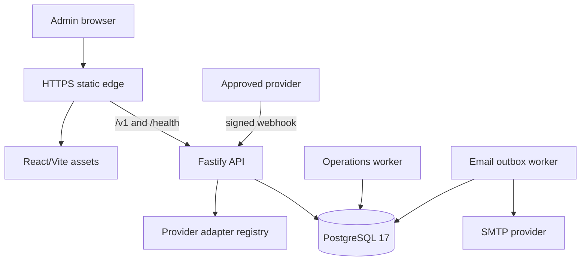

# EarnPearls System Architecture

## Decision

EarnPearls uses a TypeScript modular monolith: React/Vite static frontend, Fastify API,
PostgreSQL 17, and independent Node workers. This gives a small team one transactional
model and release while preserving boundaries that can later become services. PostgreSQL
is chosen over serverless document storage because wallet transitions, idempotency,
evidence, row locks, and relational reporting require strong transactions and constraints.

The deployment remains vendor-neutral. Current free-tier staging uses Render-compatible
services and an external TLS PostgreSQL database; production vendor, region, and recovery
features remain owner decisions.

## Runtime topology



Static assets and API are built from the same immutable Git SHA. Browser calls use
relative `/v1` paths. Staging rewrites those paths to the API while preserving a single
browser origin for Secure SameSite cookies and CSRF.

## Workspace boundaries

| Path | Responsibility |
| --- | --- |
| `src` | React routes, components, API client, session, exact display helpers |
| `packages/contracts` | TypeBox request/response schemas shared with OpenAPI |
| `apps/api/src/app.ts` | plugin order, error contract, health and module registration |
| `apps/api/src/modules/*` | auth, users, surveys, wallet, withdrawals, content, support, notifications, leaderboards, admin |
| `apps/api/src/workers` | email delivery and recurring operational jobs |
| `apps/api/migrations` | ordered forward-only PostgreSQL schema |
| `infra` | Docker and staging process supervision |

Modules call explicit service functions and the database abstraction. Cross-domain facts
are referenced by stable IDs and append-only events rather than copying mutable balances.

## Request lifecycle

1. Trusted proxy and request ID are established.
2. Logging redaction, security headers, body limit, CORS, cookie, and rate-limit plugins run.
3. Stable error handler converts known and unknown failures to one envelope.
4. Maintenance and feature hooks enforce global/product availability.
5. Authentication resolves the opaque session and effective capabilities.
6. State mutations verify session-bound CSRF and module permission.
7. TypeBox validates params/query/body; service opens the required transaction.
8. Response is schema-serialized; errors never expose stack or secret values.

Plugin order is security-significant. Maintenance/feature errors must pass through the
canonical handler, and provider webhooks must bypass member feature visibility while still
requiring provider signature and idempotency.

## Identity and authorization

Passwords use Node scrypt with a unique application pepper. Sessions store only a hashed
opaque token and are expiry/revocation bound. Production cookies are Secure, HttpOnly for
session, SameSite=Lax, and paired with a readable CSRF cookie whose exact value must be sent
in the mutation header.

Effective capability:

```text
union(role permissions) minus union(active Limit Template denials)
```

Limit Templates cannot grant. Account states may block login or product actions. Frontend
navigation consumes server-returned capabilities, but all authority is rechecked by API.

## Financial architecture

Authoritative facts are stored as integer points and integer USD micro-units. API contracts
serialize large integers as decimal strings. JavaScript `Number` is never authoritative.

`wallet_transactions` holds immutable financial facts and current projection. Each state
transition appends a `wallet_transaction_event` and balanced `wallet_entries`. Database
triggers prevent modification/deletion of evidence and modification of financial facts.
Withdrawals reserve available points in a serializable transaction; rejection/cancellation
adds entries that return the reservation.

Provider confirmation and settlement evidence are distinct. Time can make an already
validated reward eligible for a reviewed maturity action, but cannot validate a pending
reward by itself.

## Provider architecture

`ProviderAdapter` is the stable boundary for discovery/launch/event normalization.
Registry lookup is explicit; enabling a database provider without a server adapter is
rejected. Adapter responsibilities:

- validate provider-specific signature and replay controls;
- normalize external IDs/status/reward evidence;
- obey provider launch URL and workflow requirements;
- record sync health, duration, counts, and sanitized failure;
- preserve the raw external reference without storing unnecessary payload secrets.

Demo behavior exists only when `ALLOW_DEMO_DATA=true`. Real adapters require contract,
sandbox evidence, credentials, callback allowlist, maturity/reversal mapping, and an owner.

## Workers and reliability

The email worker claims rows with a lease, renders enabled database templates, sends via
SMTP, retries with bounded exponential backoff, and exposes dead letters. Token material is
encrypted at rest and decrypted only in worker memory.

The operations worker creates deduplicated scheduled jobs and uses `FOR UPDATE SKIP LOCKED`
to claim work. It publishes scheduled content, calculates daily metrics, refreshes/finalizes
leaderboards, expands notification broadcasts, and enforces retention. Failed jobs retain
sanitized errors and retry state. CI runs one-shot fail-fast mode on real PostgreSQL.

PostgreSQL queueing is intentional for Version 1: it keeps queue state transactional with
business events and avoids an unused Redis dependency. Revisit when measured queue volume,
latency, or isolation requirements exceed database capacity.

## Data consistency and concurrency

- registration and unique identifiers rely on database uniqueness;
- survey/provider events and withdrawal submissions use durable idempotency records;
- wallet/withdrawal transitions lock relevant rows and validate allowed source state;
- job and email claims use row locking with skip-locked leases;
- settings/content/template changes store revisions in the same transaction as mutation;
- audit records are written inside the business transaction for material admin actions.

## Security architecture

Threat controls include allowlisted CORS, Helmet headers, small bodies, schema validation,
parameterized SQL, rate limits, brute-force events, opaque sessions, CSRF, least privilege,
AES-256-GCM sensitive fields, hashed IP evidence, signed provider events, idempotency,
append-only audit/ledger records, secret redaction, production configuration assertions,
dependency audits, and CodeQL.

Support uploads are not exposed until private object storage, size/type allowlisting,
checksum, malware scanning, quarantine, signed download authorization, retention, and
incident response are configured.

## Availability and degradation

`/health/live` proves process life without a database read. `/health/ready` proves database
readiness and gates rollout. If SMTP is absent, API remains available and outbox remains
queued; staging supervisor logs the deliberate condition. A worker crash is independently
restarted with backoff. API exit terminates the container so the platform can replace it.

Maintenance mode presents a member-safe message while admin paths remain available for
recovery. Feature gates hide navigation and deny matching API paths. No failure may make a
disabled payout/provider more permissive.

## Performance targets

Targets for production approval, measured at the selected region and representative data:

- p75 public LCP ≤ 2.5 seconds on a mid-tier mobile connection;
- p75 interaction latency ≤ 200 ms and CLS ≤ 0.1;
- p95 read API ≤ 500 ms and mutation API ≤ 800 ms excluding provider latency;
- health endpoints ≤ 200 ms; worker backlog within approved SLA;
- database pool and query plans below provider limits with no unbounded list endpoint.

Frontend is code-split by the browser build where practical, uses no large image bundle,
and serves immutable hashed assets. Cursor/limited queries and targeted indexes bound data.
Budgets must be proven in staging/production monitoring, not assumed from local builds.

## Scaling path

1. Increase managed PostgreSQL/storage/backup tier and API instances.
2. Run workers as independent services using the same image.
3. Add connection pooling and read replicas only after measured need.
4. Extract provider ingestion or analytics when workload/isolation evidence justifies it.
5. Move queues to a managed broker only with dual-write/outbox migration design.
6. Add CDN/object storage for approved media and uploads.

Domain contracts, exact money, events, and provider adapter boundaries remain stable.

## Architecture decision records

- `docs/implementation/ADR-001-MVP-STACK.md` records the initial stack choice.
- High-risk changes require a new ADR covering context, options, security/data impact,
  migration, rollback, owner, and approval evidence.

## Known boundaries

Production monitoring vendor, error aggregator, backups/PITR, DNS, SMTP sender, legal text,
real providers, payout executor, identity/KYC policy, and storage scanner are external gates.
The architecture has explicit attachment points but does not pretend those services exist.
