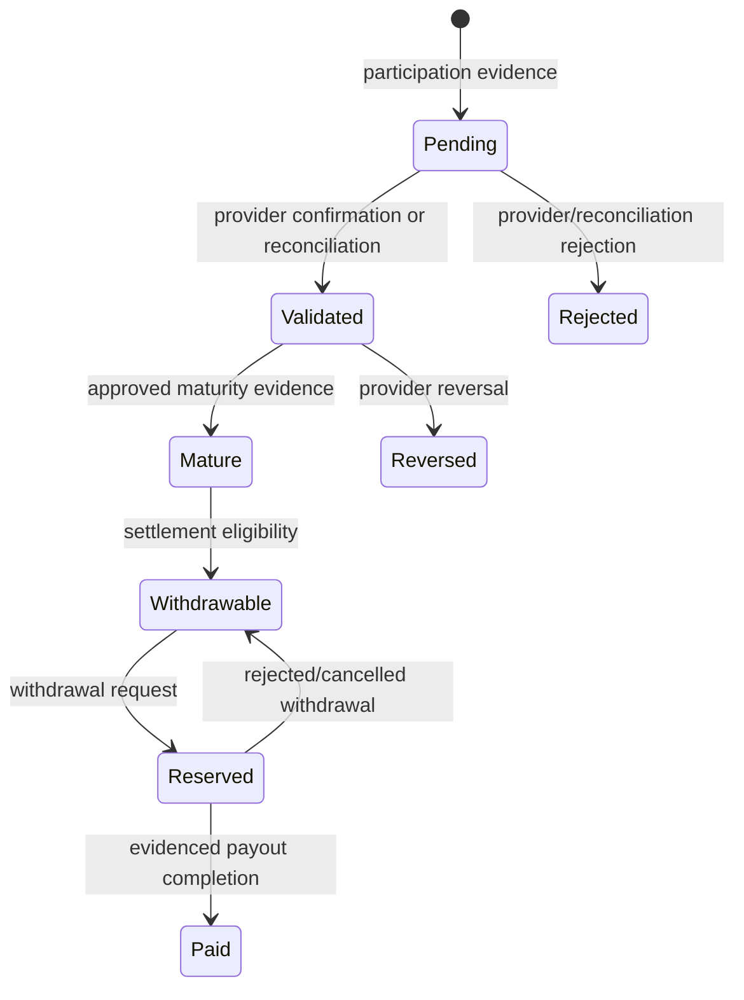

# EarnPearls Product Blueprint

Version 2.0 · implementation-aligned · English Version 1

## Product contract

EarnPearls Version 1 is a survey-first rewards account. It presents only server-approved
features and capabilities. The server owns identity, availability, financial state,
country policy, and every transition. The browser may format and request actions but
cannot grant access or calculate authoritative balances.

Points and USD are shown together. The default is 1,000 points = USD 1.00, stored as a
configurable exact integer string. Local currency is labeled as an estimate and appears
only when an approved dated rate configuration is enabled.

## Information architecture

### Public routes

| Route | Purpose | Primary actions |
| --- | --- | --- |
| `/` | Value, process, trust, reward explanation, FAQ/blog preview | Register, sign in, learn |
| `/register` | Eligible-country account creation | Submit name/email/password/country |
| `/login` | Session creation | Sign in, recover password |
| `/verify-email` | Consume emailed verification token | Verify, continue to login |
| `/forgot-password` | Request non-enumerating reset email | Submit email |
| `/reset-password` | Consume reset token and set password | Reset, sign in |
| `/about` | Versioned company/product page | Register/support navigation |
| `/contact` | Safe contact and support directions | Sign in/open support |
| `/privacy`, `/terms`, `/cookies` | Owner-approved versioned policy pages | Review policy |
| `/blog` | Searchable educational posts | Search/filter/open post |
| `/blog/:slug` | SEO article | Follow internal links |
| `/faq` | Filtered knowledge base | Read/open support |
| `/sitemap.xml` | Database-backed public URL discovery | Machine consumption |

`/index.html` canonicalizes to `/`; `/dashboard` to `/app`; `/admin/*` to
`/app/admin/*`. Unknown paths show the application 404. Staging sends a noindex header.

### Member routes

| Route | Capability | Contents and actions |
| --- | --- | --- |
| `/app` | `dashboard.read` | balances, period earnings, rank, surveys, activity, notifications, support, profile, announcements |
| `/app/surveys` | `survey.read` | filters, sort, detail, eligibility, start, history |
| `/app/wallet` | `wallet.read` | bucket balances, totals, cursor history, status explanation |
| `/app/withdrawals` | `withdrawal.read` | method eligibility, request, estimates, status/reference/support |
| `/app/leaderboards` | `leaderboard.read` | enabled boards, current period, member rank, history |
| `/app/notifications` | `notification.read` | unread/read/archive/delete, mark all read |
| `/app/support` | `support.read` | categories, ticket list, create ticket |
| `/app/support/:id` | `support.read` | status, conversation, reply |
| `/app/profile` | `profile.read` | identity profile, timezone/currency, preferences, activity |
| `/app/security` | `security.sessions.manage` | password change, sessions, revoke one/all |

Navigation requires the capability and an enabled feature flag. Direct API calls are
subject to the same policy. A disabled feature returns a stable unavailable response;
maintenance blocks non-admin product paths while preserving operator access.

### Administrator routes

| Route | Capability | Operations |
| --- | --- | --- |
| `/app/admin` | `admin.dashboard.read` | users, rewards, withdrawals, providers, jobs, mail, support, content health |
| `/app/admin/users` | `admin.users.read` | search/filter/sort, CSV export, open member |
| `/app/admin/users/:id` | `admin.users.read` | profile, roles, sessions, wallet, surveys, support, notifications, activity/security |
| `/app/admin/withdrawals` | `admin.withdrawals.read` | review and evidenced approve/reject/paid transitions |
| `/app/admin/payout-methods` | `admin.withdrawal_methods.manage` | create/update disabled-first method rules |
| `/app/admin/reconciliation` | `admin.surveys.reconcile` | provider-evidenced validate/reject and wallet maturity |
| `/app/admin/support` | `admin.support.read` | filter queue and open ticket |
| `/app/admin/support/:id` | `admin.support.manage` | reply/internal note/priority/status/assignment |
| `/app/admin/content` | `admin.content.read` | pages, blog categories/posts/tags, FAQs, scheduling, SEO, revisions |
| `/app/admin/communications` | `admin.notifications.manage` | announcements, broadcasts, email templates |
| `/app/admin/providers` | `admin.providers.read` | registry, health, visibility, configuration, activation evidence |
| `/app/admin/countries` | `admin.countries.manage` | enabled/blocked/future/review state and reason |
| `/app/admin/settings` | `admin.settings.read` | safe JSON settings, revisions, feature/maintenance controls |
| `/app/admin/roles` | `admin.roles.read` | role permission map and audited assignment/revocation |
| `/app/admin/limit-templates` | `admin.limit_templates.manage` | create/edit/clone capability-denial templates |
| `/app/admin/jobs` | `admin.jobs.read` | status, attempts, errors, retry eligible work |
| `/app/admin/analytics` | `admin.reports.read` | DAU/WAU/MAU, funnel, rewards, withdrawals, support, daily series |
| `/app/admin/system-health` | `admin.security.read` | security events, provider sync, API/mail/job evidence |
| `/app/admin/leaderboards` | `admin.leaderboards.manage` | board configuration/reset, seasons, exclusions |
| `/app/admin/audit-log` | `admin.audit.read` | searchable immutable administrative evidence |

Admin visibility never substitutes for API authorization. Every mutation uses CSRF,
schema validation, permission checks, a reason when material, and an audit record.

## Core workflows

### Registration and verification

1. Frontend loads public settings and enabled countries.
2. Member supplies display name, normalized email, strong password, and listed country.
3. API checks registration switch and database country state inside the request.
4. Password is scrypt-hashed with a server pepper; user/preferences are created.
5. An encrypted verification token is queued in the transactional email outbox.
6. Public response does not expose account existence or token.
7. Verification consumes a hashed token once and records activity/security evidence.

Failure states: registration disabled, country unavailable, validation error, rate limit,
duplicate-safe generic result, expired/consumed token, network/server failure.

### Login and sessions

1. API validates credentials without revealing which field failed.
2. Account state and effective capabilities are resolved.
3. Opaque session and session-bound CSRF cookies are issued as Secure in production.
4. Client renders only server-returned capabilities.
5. Session list shows device/user-agent summary and last activity.
6. Revocation invalidates one or all sessions. Password reset/change revokes other sessions.

### Survey discovery and start

1. API selects active surveys only from enabled providers, within schedule and country.
2. Member can filter category/difficulty/device and sort reward/time/newness.
3. Detail repeats reward, time, difficulty, eligibility, provider visibility, and delay note.
4. Start creates or returns the idempotent participation before returning launch URL.
5. The provider workflow is opened without modifying prohibited provider behavior.
6. Signed provider event or authorized reconciliation updates participation and ledger.

No inventory produces an honest empty state. Starting does not imply completion or reward.

### Reward lifecycle

Every transaction stores points, USD micro-units, description, source reference, dates,
estimated maturity, current bucket, and append-only events/entries. Financial facts cannot
be edited. Corrections are new evidenced events/transactions, never silent mutation.

### Withdrawal request

1. API reads global withdrawal setting; if off, no destination is collected.
2. Member must have withdrawal capability and verified email.
3. Method must be enabled, available for country, and have a supported destination type.
4. Amount must meet method minimum/fee rules and withdrawable balance.
5. A stable idempotency key prevents duplicates.
6. Serializable transaction reserves points and stores an AES-256-GCM destination plus mask.
7. Member sees request time, status, estimate, completed time, reference, and support link.
8. Admin decisions require evidence. Rejection returns reserved points; paid requires a
   payout reference. No live automated executor exists until a vendor is approved.

### Notifications and email

Categories: survey, reward, withdrawal, security, announcement, support, promotion, system.
Security email/in-app notices cannot be opted out. Other channels follow preferences;
marketing email requires opt-in. Notifications support unread, read, archived, and deleted.

Email templates are database-backed and versioned. Allowed variables are fixed per code,
recipient values are HTML-escaped, unsafe HTML patterns are rejected, and verification/
reset templates cannot be disabled. The outbox uses leases, backoff, and dead-letter state.

### Support

Member selects a category, subject, priority, and message. Ticket number, status,
conversation, last update, and replies remain visible. Admin may add internal notes,
assign, prioritize, and transition status. Messages/events are append-only. Attachment
metadata is modeled, but upload stays disabled until object storage and malware scanning
are configured; the UI must never imply otherwise.

### Content publishing

Pages, posts, and FAQs have draft/published/archived states; pages/posts also schedule.
Every save creates a revision with actor and reason. The operations worker publishes due
content. Public routes expose only due published records. Blog supports categories, tags,
authors, featured-image URL, search, metadata, canonical paths, and database sitemap.
Legal publication requires owner-approved text outside the code workflow.

### Leaderboards

Definitions support weekly/monthly/seasonal cadence and points/survey metrics. Rankings
aggregate reward and survey facts separately to avoid join multiplication, exclude hidden
members, and use deterministic tie order. Current materialization may refresh; finalized
period history remains evidence. Streak/referral metrics stay inactive until their domains
exist.

### Background work

- email delivery worker: claim, send, retry, dead-letter, delivery status;
- content publisher: publish due pages/posts;
- analytics rollup: daily operational metrics;
- leaderboard snapshot: current materialization and period finalization;
- broadcast worker: audience expansion and preference-aware delivery;
- retention cleanup: expired sessions/tokens/idempotency/notifications/outbox;
- provider sync jobs: provider-specific adapters when approved.

Jobs are PostgreSQL-backed and claim with `SKIP LOCKED`. CI runs recurring operations in
one-shot fail-fast mode against PostgreSQL.

## Administrator roles

Default roles: Super Admin, Operations Admin, Finance Admin, Support Admin, Content Admin,
Marketing Admin, Developer, and Read Only Auditor. Permissions are granular and inspectable.
Super Admin receives all registered admin permissions. Other roles receive only their
documented module set. Role assignment and removal require Super Admin-level permission,
reason, audit, and self-lockout safeguards.

Limit Templates are independent deny overlays: withdrawal restricted, support only,
read only, temporary restriction, or survey disabled can be represented by denied
capabilities. They never grant access and assignment is recorded in account-state history.

## Settings and invariant validation

Admin-manageable settings include points conversion, registration, maintenance, features,
leaderboards, support, content/blog, security policy, currency display, retention, global
withdrawals, and wallet adjustments. Validation enforces:

- exact positive points conversion and immutable USD accounting base;
- dated decimal-string local rates only when estimates are enabled;
- country enforcement cannot be bypassed;
- referrals/offerwalls/cashback/games cannot activate before implementation;
- attachments cannot activate without secure storage/scanning;
- high-risk financial switches require an approval-evidence reference;
- retention/security bounds cannot be set to unsafe values.

## Feedback, errors, and accessibility

Forms label fields, show validation near the action, disable while submitting, and display
explicit success. Destructive/high-risk admin operations ask for evidence and reason.
Tables have headers and mobile overflow; navigation and dialogs are keyboard reachable;
focus order, skip link, status text, contrast, and screen-reader labels are tested.

System states include loading, empty, offline/network, unauthenticated, access denied,
not found, rate limited, conflict, validation, server error, maintenance, and disabled
feature. Raw SQL, stack traces, secrets, tokens, and payout destinations never appear.

## SEO and public trust

Each public screen supplies title, description, canonical URL, Open Graph/Twitter metadata,
and appropriate structured data. Breadcrumb/internal links support discovery. `robots.txt`
excludes app/admin areas. The XML sitemap merges core public routes with due published CMS
and blog records and removes blog URLs when the feature is disabled. Staging is noindex.

Testimonials remain explicitly marked placeholders until genuine consented evidence is
approved. Provider logos/names and earnings claims require contractual and factual approval.

## Analytics and privacy

Operational analytics aggregate sessions, registrations, verification, survey validation,
reward points, withdrawals, and support response. Precise traffic/product analytics are not
silently added. Any new tracker requires purpose, consent basis, data map, retention,
processor review, and opt-out design. Reports avoid unnecessary personal data.

## Acceptance definition

A feature is complete when its server rules, schema, UI, errors, authorization, audit/
activity evidence, tests, OpenAPI, documentation, monitoring expectations, and rollback
are present. A provider/payout/legal/hosting item is launch-ready only when its external
owner evidence is also recorded. Passing CI never converts an external gate into approval.

## Blueprint self-review (Version 2 changes)

This revision removes assumed integrations, maps every implemented route to authority,
separates feature visibility from financial activation, treats content and email templates
as versioned operations, and identifies attachment/legal/live-money boundaries explicitly.
Customizable admin widget layout, user import/merge, push notifications, streak/referral
rankings, and localization remain deferred because implementing empty controls would be
misleading. They must follow the same acceptance definition when scheduled.
